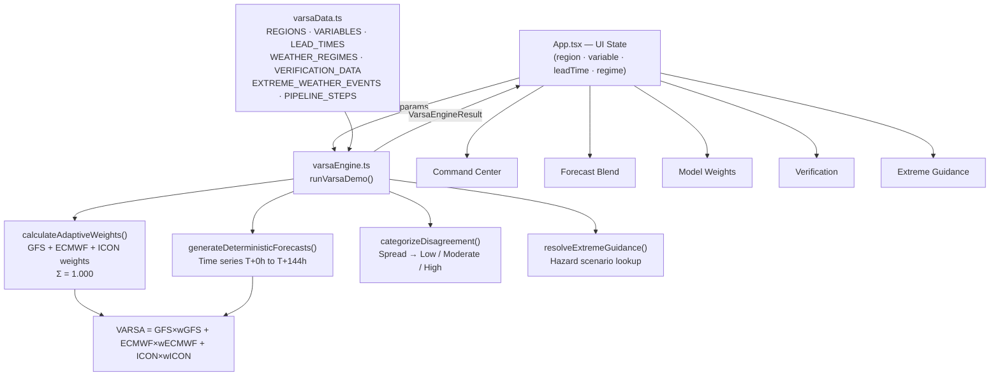

# VARSA — Adaptive Weather Intelligence Engine

> **"When weather models disagree, VARSA learns which forecast to trust — and how much."**

VARSA is a prototype adaptive forecast-blending intelligence layer that sits above multiple Numerical Weather Prediction (NWP) models — GFS, ECMWF, and ICON — and combines their outputs using context-dependent weights rather than treating every model equally.

**Live Demo:** [https://varsa-demo.vercel.app](https://varsa-demo.vercel.app)  
**Technical Documentation Report (PDF):** [docs/VARSA_Technical_Documentation.pdf](docs/VARSA_Technical_Documentation.pdf)

> **⚠️ Prototype / Demonstration Notice**
> The current implementation operates entirely on a local deterministic prototype dataset structured to demonstrate the adaptive blending concept. All weights, verification metrics, and forecast values are demonstration data. This is **not** an operational system and does not claim validated real-world forecasting performance.

---

## Problem

Global weather forecasting relies on several independent Numerical Weather Prediction (NWP) models, each produced by different meteorological agencies with different grid resolutions, physical parameterisation schemes, and regional strengths:

| Model | Producer | Resolution |
|---|---|---|
| GFS | NOAA (USA) | 0.25° global |
| ECMWF IFS | ECMWF (Europe) | 0.1° HRES |
| ICON | DWD (Germany) | 13 km global |

These models can produce meaningfully different forecasts for the same location, variable, and time — particularly over complex terrain, during extreme weather events, or at longer forecast horizons.

A naive approach treats all models equally (simple mean). A more principled approach would ask: *given the current meteorological context, which model should be trusted more, and by how much?*

VARSA explores that question through a contextual adaptive weighting framework.

---

## How VARSA Works

The demonstrated pipeline:

```
GFS + ECMWF + ICON  (NWP model inputs)
         ↓
  Data Harmonization
         ↓
  Context Analysis
  (Region · Variable · Lead Time · Weather Regime)
         ↓
  Adaptive Weight Calculation
  Σ wGFS + wECMWF + wICON = 1.000 (100%)
         ↓
  Weighted Forecast Blend
  VARSA = (GFS × wGFS) + (ECMWF × wECMWF) + (ICON × wICON)
         ↓
  Verification / Demonstration Metrics
         ↓
  Extreme Weather Guidance
```

### Blending Equation

```
VARSA = (GFS × wGFS) + (ECMWF × wECMWF) + (ICON × wICON)
```

Weights are always normalised so that:

```
wGFS + wECMWF + wICON = 1.000  (100%)
```

The weights are calculated deterministically by `calculateAdaptiveWeights()` in [`src/lib/varsaEngine.ts`](src/lib/varsaEngine.ts) based on the active forecast context. The blended VARSA value is the **direct mathematical result** of the equation above — not a lookup or estimate.

---

## Adaptive Context

In this prototype, the weight allocation varies across four context dimensions:

| Dimension | Options Demonstrated |
|---|---|
| **Region** | North · Central · West · East · South · Northeast India |
| **Variable** | Precipitation (mm/24h) · 2m Temperature (°C) · 10m Wind Speed (km/h) |
| **Lead Time** | T+24h · T+48h · T+72h · T+96h · T+120h |
| **Weather Regime** | SW Monsoon Convection · Western Disturbance · Pre-Monsoon Heatwave · Coastal Depression |

Additionally, a **model disagreement** metric (spread = max − min of model values) is computed dynamically and categorised as Low / Moderate / High.

Different combinations of these dimensions produce different weight distributions. For example, at longer lead times the weight allocation shifts toward models with stronger synoptic-scale representation, while at shorter lead times more weight may be given to models with finer resolution for mesoscale features.

> These allocation patterns are demonstration logic. They are not calibrated against historical observation archives.

---

## Demonstration Scenarios

Four pre-configured scenarios are included in the UI to illustrate contrasting weight allocations:

| Scenario | Region | Variable | Lead Time | Weather Regime |
|---|---|---|---|---|
| **A** | Central India | Rainfall | +24h | SW Monsoon Convection |
| **B** | North India | Temperature | +48h | Pre-Monsoon Heatwave |
| **C** | South India | Rainfall | +72h | SW Monsoon Convection |
| **D** | West India | Wind Speed | +24h | Coastal Depression |

Each scenario immediately updates all five views with consistent values derived from the central VARSA engine. Weights sum to 100% in every case.

---

## Prototype Features

### Five Views

#### 1. Command Center (Overview)
The primary dashboard. Shows the India forecast map with clickable macro-regions, the adaptive model weights panel, the blended forecast readout strip, the full multi-model chart, and active regional hazard signals. All controls (region, variable, lead time, weather regime) are live-interactive.

#### 2. Forecast Blend
Detailed time-series view (T+0h to T+144h) showing how GFS, ECMWF, ICON, and the VARSA blend evolve over the forecast horizon. Includes an interactive tabular matrix with observation reference values and per-timestep model spread.

#### 3. Model Weights
Geographic weight-surface view. A choropleth map shows which model receives the highest allocation in each of the six macro-regions for the current context. Supports four layer views: Dominant Model, ECMWF weight, ICON weight, GFS weight.

#### 4. Verification
Comparative metric scorecard: MAE, RMSE, Bias, CSI, POD, and FAR across GFS, ECMWF, ICON, Equal-Weight baseline, and VARSA. Values are **prototype demonstration data** and are clearly labelled as illustrative — not measured operational performance.

#### 5. Extreme Guidance
A hazard guidance catalog demonstrating how multi-model consensus would surface early warnings for heavy rainfall, heatwave, and high-wind scenarios. Includes severity classification, affected district listings, model consensus narratives, and operational guidance text. All scenarios are labelled as prototype demonstrations.

---

## Technology Stack

All items below are confirmed present in [`package.json`](package.json) or the source files.

| Category | Technology |
|---|---|
| **UI Framework** | React 19 |
| **Language** | TypeScript 7 |
| **Build Tool** | Vite 8 |
| **Styling** | Tailwind CSS v4 (via `@tailwindcss/vite`) |
| **Icons** | `lucide-react` |
| **Animation** | `motion` (Framer Motion) |
| **Charts** | Custom SVG — hand-written React components (no external chart library) |
| **Type Checking** | `tsc --noEmit` |
| **Deployment** | Vercel (static, SPA rewrites via `vercel.json`) |

---

## Project Architecture

```
src/
├── lib/
│   └── varsaEngine.ts           # Central demonstration engine (single source of truth)
├── data/
│   └── varsaData.ts             # Types, lookup tables, verification data, extreme events
├── components/
│   ├── IndiaMap.tsx             # SVG India map — clickable macro-regions, choropleth
│   ├── ForecastChart.tsx        # Custom SVG time-series chart (0h–144h)
│   ├── AdaptiveWeightsPanel.tsx # Weight bars + live blend formulation display
│   ├── ForecastBlendingScreen.tsx   # Forecast Blend view
│   ├── ModelWeightMapScreen.tsx     # Model Weights view
│   ├── VerificationScreen.tsx       # Verification view
│   ├── ExtremeWeatherScreen.tsx     # Extreme Guidance view
│   ├── BlendPipelineModal.tsx       # Animated 6-step pipeline execution modal
│   └── MethodologyModal.tsx         # Architecture & methodology reference modal
├── App.tsx                      # Root — state management, navigation, engine call
├── main.tsx                     # React entry point
└── index.css                    # Global styles
```

### Architecture Diagram



---

## Core Engine

All engine logic lives in [`src/lib/varsaEngine.ts`](src/lib/varsaEngine.ts). The engine is the **single source of truth** — every view consumes its output.

### `runVarsaDemo(params)`

The main entrypoint. Accepts `{ region, variable, leadTime, weatherRegime }` and returns a `VarsaEngineResult` containing:

- All deterministic model forecasts (GFS, ECMWF, ICON) for T+0h to T+144h
- Adaptive weights with sum guarantee
- The VARSA blended value (strict mathematical calculation)
- Equal-weight baseline for comparison
- Observation reference values
- Model disagreement spread and level
- Active extreme weather event
- Context summary and weight rationale

### `calculateAdaptiveWeights(region, leadTime, regime, variable)`

Produces the `ModelWeights` object. Weights are calculated deterministically from the four context dimensions, then normalised to guarantee:

```
Math.round(gfs × 100)/100 + Math.round(ecmwf × 100)/100 + Math.round(icon × 100)/100 = 1.00
```

### `generateDeterministicForecasts(region, variable, weights, regime)`

Produces the 7-point time series (T+0h, T+24h, T+48h, T+72h, T+96h, T+120h, T+144h). Each point's `varsa` value is the direct mathematical result:

```typescript
const rawVarsa = (gfsVal * weights.gfs) + (ecmwfVal * weights.ecmwf) + (iconVal * weights.icon);
```

### `categorizeDisagreement(spread, variable)`

Classifies the model spread (max − min across GFS, ECMWF, ICON) as `Low`, `Moderate`, or `High` using variable-specific thresholds.

### `resolveExtremeGuidance(region, variable, leadTime, blendedVal)`

Matches the current context to the hazard catalog in `varsaData.ts`, or generates a dynamic demonstration scenario if the blended value exceeds meteorological alert thresholds.

### `DEMO_SCENARIOS`

Four pre-configured `VarsaEngineParams` objects that populate the scenario preset buttons in the UI.

---

## Verification

The Verification screen displays comparative performance metrics across five systems:

| Metric | Description |
|---|---|
| **MAE** | Mean Absolute Error — average magnitude of forecast deviation |
| **RMSE** | Root Mean Square Error — penalises large errors more heavily |
| **Bias** | Mean directional tendency (+ over-forecast, − under-forecast) |
| **CSI** | Critical Success Index — skill at detecting threshold-exceedance events |
| **POD** | Probability of Detection — proportion of observed events correctly forecast |
| **FAR** | False Alarm Ratio — proportion of forecasted events that did not verify |

> **Important:** All values in the Verification screen are **prototype demonstration data** stored in `VERIFICATION_DATA` inside [`src/data/varsaData.ts`](src/data/varsaData.ts). They are structured to illustrate what a multi-model verification framework would look like. They are **not** derived from evaluation against historical observation archives and do **not** constitute a claim of operational performance improvement.

---

## Live Demo

🌐 **[https://varsa-demo.vercel.app](https://varsa-demo.vercel.app)**

Deployed on Vercel as a static site. All five views and four demonstration scenarios are fully functional on the deployed version. Every `git push` to `main` triggers an automatic re-deployment.

---

## Getting Started

### Prerequisites

- Node.js ≥ 18
- npm ≥ 9

### Install and Run

```bash
# Clone the repository
git clone https://github.com/harsh2407-coder/VARSA.git
cd VARSA

# Install dependencies
npm install --legacy-peer-deps

# Start the development server
npm run dev
```

The app will be available at **http://localhost:3000**

### Build for Production

```bash
npm run build
```

Output is written to `dist/`. Serve with any static host or use `npm run preview` for a local production preview.

### Type Check

```bash
npm run lint
```

---

## Intended Production Architecture

The following describes the **intended future direction**, not the current implementation:

```
Live NWP API feeds (GFS / ECMWF / ICON)
              ↓
    Data harmonization layer
              ↓
    Historical skill & context features
              ↓
    XGBoost adaptive weight inference
    (trained on NWP-observation error archives)
              ↓
    Blended forecast + uncertainty bands
              ↓
    Observation-based rolling verification
              ↓
    Feedback loop → updated skill weights
```

Key production components that do **not** exist in the current prototype:
- Live NWP API ingestion
- Historical observation database
- Trained ML weight model
- Real-time alert integration

---

## Repository Structure

```
VARSA/
├── src/
│   ├── lib/varsaEngine.ts       # Core demonstration engine
│   ├── data/varsaData.ts        # Types + prototype datasets
│   ├── components/              # Nine UI components
│   ├── App.tsx                  # Root app + navigation
│   ├── main.tsx
│   └── index.css
├── index.html
├── vite.config.ts
├── tsconfig.json
├── vercel.json                  # Vercel deployment configuration
└── package.json
```

---

## Disclaimer

VARSA is a **Smart India Hackathon 2026 showcase prototype**.

- All forecast values are deterministic demonstration outputs, not real NWP model data.
- All verification metrics are structured prototype values, not measured against observation archives.
- No production forecasting claims are made.
- The application has no external API dependencies or live data connections in its current form.

---

*VARSA — Adaptive Weather Intelligence Engine · SIH 2026 Prototype · Deterministic Demonstration Dataset*
